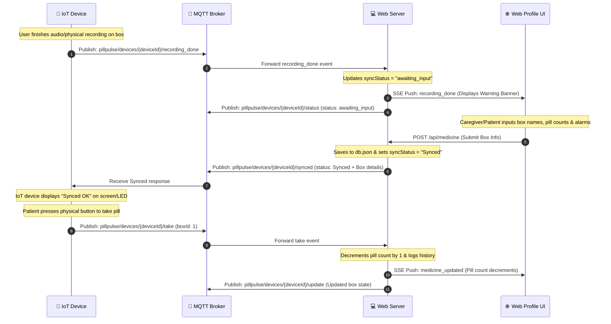

# MQTT Server & IoT Hardware Interface Specification

This document lays out the exact requirements, topic hierarchy, JSON schemas, and operational workflow for the IoT hardware device (e.g., ESP32 / STM32 / Raspberry Pi) communicating with the **PillPulse** web server over MQTT.

---

## 1. Connection & Broker Setup

- **Default Broker URL**: `mqtt://broker.hivemq.com` (or custom private broker configurable via `process.env.MQTT_BROKER`)
- **Port**: `1883` (TCP) or `8883` (TLS)
- **QoS Level**: `1` (At least once delivery)
- **Device Identifier**: Each physical device must have a unique `deviceId` string (e.g. UUID `7021dbcb-dc27-41c0-a7af-22aa54e7a45d` or MAC address hash).

---

## 2. Topic Hierarchy & Message Protocols

All topics are prefixed with `pillpulse/devices/{deviceId}/`.

| Direction | Topic | Purpose | Payload Example |
| :--- | :--- | :--- | :--- |
| **IoT → Web Server** | `pillpulse/devices/{deviceId}/recording_done` | Sent by IoT device when recording/enrollment finished | `{"deviceId": "XYZ-123"}` |
| **IoT → Web Server** | `pillpulse/devices/{deviceId}/take` | Sent by IoT device when physical pill box button pressed | `{"deviceId": "XYZ-123", "boxId": 1}` |
| **Web Server → IoT** | `pillpulse/devices/{deviceId}/synced` | Response sent by server after user inputs info in web profile | `{"status": "Synced", "boxes": [...]}` |
| **Web Server → IoT** | `pillpulse/devices/{deviceId}/status` | Server status update (e.g. `awaiting_input`, `Synced`) | `{"status": "awaiting_input"}` |
| **Web Server → IoT** | `pillpulse/devices/{deviceId}/update` | Published when box schedules/names/pills count change | `{"boxes": [...]}` |

---

## 3. Detailed Workflow & Message Schemas



---

## 4. Message Payload Schemas

### A. Recording Completed Notification (IoT → Server)
**Topic**: `pillpulse/devices/{deviceId}/recording_done` (or `.../record`)
```json
{
  "deviceId": "7021dbcb-dc27-41c0-a7af-22aa54e7a45d",
  "timestamp": "2026-07-22T16:45:00Z"
}
```

### B. Synced Response (Server → IoT)
**Topic**: `pillpulse/devices/{deviceId}/synced`
```json
{
  "deviceId": "7021dbcb-dc27-41c0-a7af-22aa54e7a45d",
  "status": "Synced",
  "message": "Web profile information updated and synchronized with IoT device",
  "syncedAt": "2026-07-22T16:45:30.123Z",
  "boxes": [
    {
      "id": 1,
      "name": "Aspirin",
      "pills": 20,
      "schedules": ["08:00", "20:00"]
    },
    {
      "id": 2,
      "name": "Vitamin C",
      "pills": 30,
      "schedules": ["12:00"]
    },
    {
      "id": 3,
      "name": "Paracetamol",
      "pills": 15,
      "schedules": ["09:00"]
    },
    {
      "id": 4,
      "name": "",
      "pills": 0,
      "schedules": []
    }
  ]
}
```

### C. Physical Pill Take Event (IoT → Server)
**Topic**: `pillpulse/devices/{deviceId}/take`
```json
{
  "deviceId": "7021dbcb-dc27-41c0-a7af-22aa54e7a45d",
  "boxId": 1
}
```

---

## 5. IoT Device Implementation Checklist

1. **WiFi / Cellular Connection**: Establish connection and subscribe to:
   - `pillpulse/devices/{deviceId}/synced`
   - `pillpulse/devices/{deviceId}/status`
   - `pillpulse/devices/{deviceId}/update`
2. **Recording State Handling**:
   - When recording/enrollment is completed on the hardware, publish to `pillpulse/devices/{deviceId}/recording_done`.
   - Wait for the incoming `synced` message on `pillpulse/devices/{deviceId}/synced`.
   - Once received, light up the "Synced" green indicator LED or update display.
3. **Pill Take Button Handling**:
   - Debounce physical button presses (e.g. 500ms delay).
   - On valid press of Box $N$, publish `{"deviceId": "{deviceId}", "boxId": N}` to `pillpulse/devices/{deviceId}/take`.
